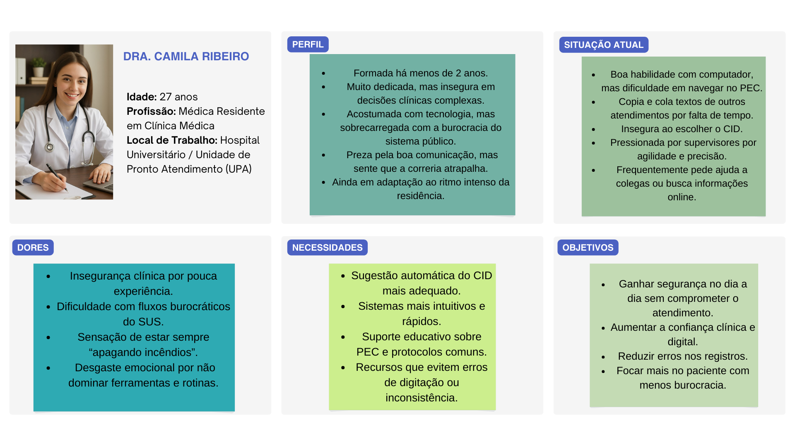
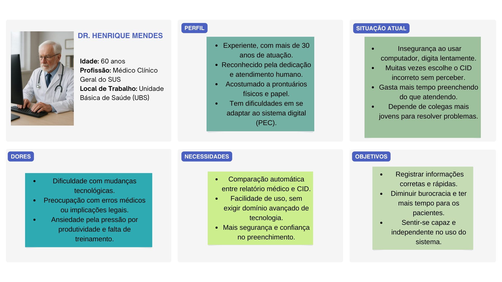
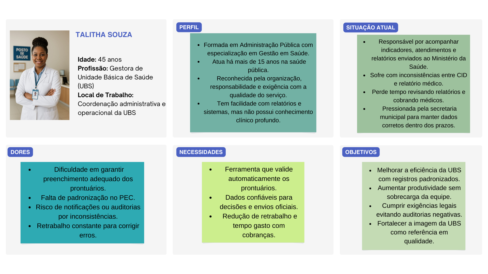
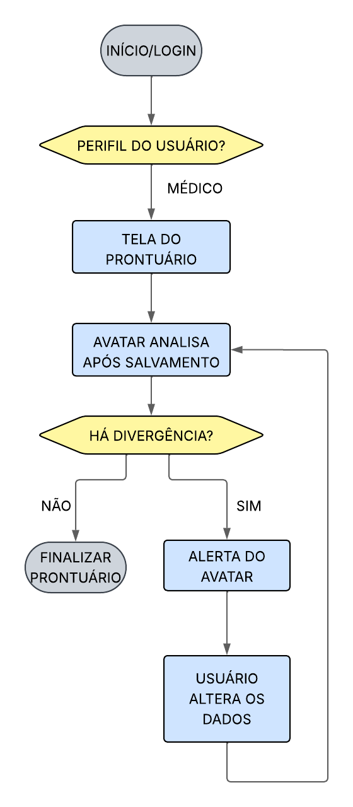

# 📌 Catch CID

O Catch CID é um projeto de extensão que tem como objetivo auxiliar na conferência dos CIDs (Classificação Internacional de Doenças) preenchidos pelos médicos durante o registro de prontuários. A proposta é verificar se os sintomas descritos pelo profissional de saúde são compatíveis com o CID atribuído, reduzindo erros que podem comprometer o diagnóstico, o atendimento e até o faturamento dos hospitais.
Para fins de estudo e validação, utilizaremos o PEC (Prontuário Eletrônico do Cidadão, do e-SUS AB) como base de análise e teste.

---
## 👥 Integrantes

- Davi Freire Zanatta - RA: 820495
- Gabriela Ribeiro Batista - RA: 837524
- Gabrielle Do Carmo Assunção - RA: 825565
- Rayara Sousa Carvalho - RA: 833567

---
## ✅ Justificativa 
Com o grande volume de prontuários gerados diariamente, cresce também a ocorrência de divergências entre os sintomas relatados e o CID registrado. Esses erros podem acontecer por descuido, falta de tempo ou pela complexidade de interpretação clínica. Dessa forma, torna-se necessária a criação de um sistema de verificação automatizada, capaz de identificar possíveis inconsistências e sugerir correções, contribuindo para:

- Aumento da precisão nos registros médicos;<br>

- Apoio à tomada de decisão clínica;<br>

- Maior eficiência no fluxo de trabalho dos profissionais de saúde.

---

## ❗ Lean Canvas


---

## ⚙ Requisitos (Funcionais e Não Funcionais)

### Requisitos Funcionais
| Código   | Descrição                                                                                  | Prioridade |
| -------- | ------------------------------------------------------------------------------------------ | ---------- |
| **RF01** | O sistema deve se integrar ao prontuário eletrônico hospitalar.                            | Alta       |
| **RF02** | O sistema deve analisar o texto digitado pelo médico após ser salvo.                       | Alta       |
| **RF03** | O sistema deve exibir um sinal de alerta em casos de inconsitências do CID.                | Alta       |
| **RF04** | O sistema deve identificar divergências entre o CID registrado e o conteúdo do prontuário. | Alta       |
| **RF05** | O sistema deve exibir um avatar interativo na tela do médico.                              | Alta       |
| **RF06** | O avatar deve mudar de expressão de acordo com a análise (neutro, alerta, crítico).        | Baixa      |
| **RF07** | O sistema deve registrar os alertas e decisões do médico em um histórico.                  | Média      |
| **RF08** | O sistema deve permitir a configuração do nível de sensibilidade dos alertas.              | Baixa      |
| **RF09** | O sistema deve gerar relatórios de inconsistências para auditoria.                         | Alta       |

### Requisitos Não Funcionais
| Código    | Descrição                                                                  | Prioridade |
| --------- | -------------------------------------------------------------------------- | ---------- |
| **RNF01** | O sistema deve atender às normas de segurança e privacidade (LGPD).        | Alta       |
| **RNF02** | A análise deve ser realizada após o salvamento, garantindo baixa latência. | Alta       |
| **RNF03** | O sistema deve estar disponível 24/7.                                      | Alta       |
| **RNF04** | O sistema deve ser escalável para múltiplos usuários simultâneos.          | Média      |
| **RNF05** | A interface deve ser simples, intuitiva e não intrusiva.                   | Média      |
| **RNF06** | O modelo de IA deve ser treinável com feedback dos médicos.                | Baixa      |
| **RNF07** | O sistema deve ser compatível com diferentes prontuários eletrônicos.      | Alta       |
| **RNF08** | O sistema deve funcionar em computadores e tablets hospitalares.           | Média      |

---
## 🥼 Personas
                                                                                                                      



---

## ✏ Histórias de Usuários 

### Contexto: Médicos

| EU COMO...                       | QUERO/PRECISO...                                                                            | PARA...                                                          |
| -------------------------------- | ------------------------------------------------------------------------------------------- | ---------------------------------------------------------------- |
| Dr. Henrique (Médico Experiente) | Receber alertas automáticos do avatar quando o CID registrado não corresponde ao prontuário | Evitar erros de registro e aumentar a segurança do atendimento   |
| Dra. Camila (Residente)          | Ter uma interface intuitiva e com poucos passos para registrar o atendimento                | Aumentar a agilidade e poder focar mais no paciente              |

### Contexto: Gestores / Administração
| EU COMO...               | QUERO/PRECISO...                                         | PARA...                                                          |
| ------------------------ | -------------------------------------------------------- | ---------------------------------------------------------------- |
| Talitha (Gestora da UBS) | Gerar relatórios consolidados de erros e inconsistências | Reduzir retrabalho e ter dados confiáveis para tomada de decisão |
| Talitha (Gestora da UBS) | Garantir padronização dos registros no sistema           | Evitar problemas em auditorias e melhorar indicadores da unidade |

---

## Projeto de Interface
1️⃣ Visão Geral da Interação do Usuário

- O usuário faz login na plataforma que ele utiliza para digitar os prontuários.<br>
- O sistema abre a tela principal do prontuário.<br>
- O avatar permanece fixo no canto da tela.<br>
- Após o médico salvar o texto, o avatar exibe alertas visuais caso sejam identificadas inconsistências entre o conteúdo registrado e o CID.

2️⃣ Wireframes das Principais Interfaces

Principais telas:<br>
- Tela do Prontuário<br>
- Área para digitação de informações clínicas<br>
- Avatar no canto da tela com alertas<br>


3️⃣ Relação com Requisitos e Histórias de Usuário
| Tela              | Requisitos Atendidos         | Histórias de Usuário                                                                                          |
| ----------------- | ---------------------------- | ------------------------------------------------------------------------------------------------------------- |
| Prontuário        | RF01, RF02, RF04, RF05, RF07 | Dr. Henrique: evitar erros de CID e usar interface simples <br> Dra. Camila: sugestões de CID e dicas rápidas |
| Chatbot           | RF08, RF09                   | Dra. Camila: aprender e reduzir erros                                                                         |
                                                                      
---

## 📈 Diagrama de Fluxo


---

## 🧩 Wireframes


---

## 🛠️ Tecnologias Utilizadas

Liste as tecnologias, linguagens, frameworks e bibliotecas utilizadas no projeto.
 - [site com os CIDs mapeados](https://cremesp.org.br/?siteAcao=cid10)
 - HTML5 – Estrutura das páginas
 - CSS3 – Estilização e layout visual
 - JavaScript (ES6) – Lógica de verificação e interatividade
 - Visual Studio Code – Ambiente de desenvolvimento

---

## 📦 Dependências e Versões

### 🧩 Requisitos de Ambiente:
Para rodar o projeto Análise de Prontuário, você pode executá-lo de duas formas:
- Diretamente pelo navegador (via GitHub Pages)
- Localmente no Visual Studio Code
  
*💡 Não há necessidade de instalar Node.js ou bibliotecas externas, pois o projeto utiliza apenas HTML, CSS e JavaScript puro.*

---

## ✅ Como Rodar o Projeto

1. Clone este repositório:
```bash
git clone https://github.com/ICEI-PUC-Minas-PPC-CC/icei-puc-minas-ppc-cc-tai2-022025-analise-de-prontuarios.git
cd icei-puc-minas-ppc-cc-tai2-022025-analise-de-prontuarios
```

2. Instale todas dependências python:
```
pip install torch flask flask-cors sentence-transformers scikit-learn pandas waitress
```

3. Execute o backend e o mantenha rodando no terminal:
```
python app.py
```

4. Abra o arquivo HTML no navegador
---

## 🧭 Diário de Bordo

### 📅 Reuniões Semanais

| Data       | Participantes        | Principais Tópicos | Decisões Tomadas | Encaminhamentos |
|------------|----------------------|--------------------|------------------|-----------------|
| 15/08/2025 | Davi, Gabriela, Gabrielle, Rayara  | -Organizar e preencher os campos no GitHub <br> -Fazer o Lean Canvas <br> -Pesquisar sobre o PEC <br>| -Nome do projeto: Catch CID <br> -Estrutura inicial do README | -Todos do grupo ficaram responsáveis por pesquisar sobre o PEC|
| 22/08/2025 | Davi, Gabriela, Gabrielle, Rayara  | -Definir as responsabilidades de cada membro do grupo | Definiu-se: <br> -Davi: Inteligência Artificial <br> -Gabriela: Banco de Dados e Inteligência Artificial <br> -Gabrielle: Banco de Dados <br> -Rayara: preenchimento do GitHub e Front-End | -Todos do grupo ficaram responsáveis por pesquisar sobre suas partes|
| 05/09/2025 | Davi, Gabriela, Gabrielle, Rayara  | -Definir as personas e histórias de usuários| Definiu-se: <br> -Criou 3 personas com contextos diferentes | -Todos do grupo ficaram responsáveis por criar as histórias e dar feedback sobre os textos criados|
| 12/09/2025 | Davi, Gabriela, Gabrielle, Rayara  | -Definir Wireframe, diagrama de fluxo e imagens para colocar nas personas| Definiu-se: <br> -Rayara: fez os desenhos necessários e o grupo deu feedback| -Todos do grupo ficaram responsáveis por verificar como a página do readme ficou após as atualizações|
| 19/09/2025 | Davi, Gabriela, Gabrielle, Rayara  | -Definir as tarefas para serem colocadas no backlog <br> -Participação da reunião sobre as orientações do Hackathon| Definiu-se: <br> -Quais tarefas seriam necessárias para executar o MVP "Fumaça" | -Todos do grupo ficaram responsáveis por analisar formas que o MVP poderia ser feito|
| 26/09/2025 | Davi, Gabriela, Gabrielle, Rayara  | -Foi separado as aplicações que deveriam ser feitas para criar o MVP "Fumaça"| Definiu-se: <br> -Davi e Gabriela: parte de ler e gravar os relatórios referentes aos erros e acertos dos CIDs <br> -Rayara: site com um formulário e avatar para execução simples <br> -Gabrielle: sistema de alertas no caso de divergências e acertos do CID| -Todos do grupo ficaram responsáveis por realizarem suas respectivas tarefas|
| 10/10/2025 | Davi, Gabriela, Gabrielle, Rayara e professor orientador Diego | -Definição do roteiro do vídeo <br> -Gravação no LabCom da PucMinas do pitch para o Hackathon| - | - |
| 12/10/2025 | Davi, Gabriela, Gabrielle, Rayara e professor orientador Diego | -Ajustes finais do relatório do projeto | -Envio da segunda etapa do Hackathon| - |

### 📦 Entregas

| Entrega       | Data       | Descrição                              | Status     | Link |
|---------------|------------|----------------------------------------|------------|------|
| Entrega 1     | 19/08/2025 | Lean Canvas + Justificativa do Problema | ✅ Entregue | - |
| Entrega 2     | 02/09/2025 | Hipóteses priorizadas + relatório das entrevistas  | ✅ Entregue | - |
| Entrega 3     | 16/09/2025 | Protótipo de baixa fidelidade / SCRUM   | ✅ Entregue | - |
| Entrevista com grupo     | 23/09/2025 | Acompanhamento do início do MVP + Apresentação das Planejamento SPRINTs |✅ Entregue | - |
| Entrega 4     | 21/10/2025 | Entrega SPRINT 01  | 🚧 Em andamento | - |
| Entrega 5     | 25/11/2025 | Entrega SPRINT 02 / Teste de Usuário| 🚧 Em andamento | - |
| Entrega 6      | 09/12/2025 | Entrega Teste de Usuário e conclusões| 🚧 Em andamento | - |


### 🧩 Tarefas Pendentes

- [x] Modelo de Lean Canvas.
- [x] Finalizar o preenchimento inicial do GitHub.
- [x] Marcar próxima reunião para revisão dos encaminhamentos.
- [x] Dividir as responsabilidades entre os membros (quem documenta, quem pesquisa, quem programa).
- [x] Levantar informações sobre o PEC (Prontuário Eletrônico do Cidadão) – documentação, manuais, exemplos de dados.
- [x] Estudar a CID-10: principais grupos de doenças, como acessar a base de códigos.
- [ ] Pesquisar soluções similares (há artigos e softwares que tentam validar CID).
- [x] Decidir a abordagem inicial: começar com regras manuais de compatibilidade entre sintomas e CIDs.
- [x] Escolher a linguagem base para o protótipo.
- [ ] Definir como serão criados os dados fictícios de prontuário para teste.
- [ ] Criar um dicionário simples de sintomas → possíveis CIDs.
- [ ] Fazer um script inicial que compara “texto dos sintomas” com “CID informado” e sinaliza inconsistência.
- [ ] Criar uma tabela ou planilha com campos que simulam o PEC: paciente, sintomas, CID, data, observações.


---

## 🛠️ Problemas Enfrentados

### Problema 1: Impossibilidade de usar prontuários reais devido à LGPD.
### Problema 2: Dependência de dados fictícios ou exemplos do PEC, que podem não cobrir todos os cenários clínicos.

---

## 🗣️ Feedbacks Recebidos

| Data       | De Quem     | Observação                                                                 | Ação Tomada                       |
|------------|-------------|-----------------------------------------------------------------------------|----------------------------------|
| 19/08/2025 | Professor Diego e Fabiano | -Melhorar alguns pontos do Lean Canvas (problema, canais, métricas, receitas, estrutura de custos, vantagem injusta)<br> -Instruções em como instalar e usar o PEC                   | -Redefinimos os pontos citados no Lean Canvas<br> -Testamos o sistema do PEC |
| 26/08/2025 | Professor Diego e Fabiano | -Instruções sobre baixar a ferramenta médica PEC | -Fizemos a instalação correta do sistema<br> -Testamos o sistema do PEC |
| 09/09/2025 | Professor Diego e Fabiano | -Feedback sobre a estruturação dos requisitos e aba Projects | -Fizemos as devidas alterações<br> -Definimos a forma que o sistema deve ser implementado |
| 23/09/2025 | Professor Diego | -Orientações sobre a entrega do MVP "Fumaça" para o Hackathon| -Definiu as tarefas para cada membro da equipe |
| 10/10/2025 | Professor Diego | -Orientações sobre a gravação do pitch| -Vídeo foi gravado e editado |
| 12/10/2025 | Professor Diego | -Orientações sobre o relatório final e os elementos para entrega da segunda etapa do Hackathon | -A segunda etapa foi enviada e finalizada |

---

## 🚀 Funcionalidades do Projeto

O sistema **Análise de Prontuário** tem como objetivo simular o preenchimento e validação de um prontuário médico, exibindo reações visuais conforme o resultado da verificação dos CIDs.

### 🧩 Funcionalidades principais

- **Formulário interativo de prontuário:** permite inserir informações de pacientes e diagnósticos simulados.  
- **Validação de CIDs:** compara o CID informado com os dados corretos, retornando feedback visual.  
- **Avatar fixo e reativo:** personagem que muda de expressão conforme acertos e erros do usuário.  
- **Base de dados fake:** utilização de dados simulados para testes, sem uso de informações reais.  
- **Geração de arquivo CSV:** exporta os dados dos prontuários para um arquivo `.csv` para consulta e análise.  
- **Interface responsiva e intuitiva:** organizada em HTML, CSS e JavaScript puro.  

### 💻 Demonstração Online
Acesse o sistema hospedado no GitHub Pages:  
👉 **[Análise de Prontuário - GitHub Pages](https://icei-puc-minas-ppc-cc.github.io/icei-puc-minas-ppc-cc-tai2-022025-analise-de-prontuarios)**

---

## 📚 Lições Aprendidas

- Trabalho em equipe e versionamento: uso do Git e GitHub para controle de versões e colaboração em grupo.
- Criação de MVP (mínimo produto viável): desenvolvimento de uma versão inicial funcional do sistema para validar ideias e fluxos principais.
- Organização por sprints: prática do método ágil, com definição de tarefas no backlog, progresso e revisão constante.
---

## 📁 Organização do Repositório

```
📦 analise_de_prontuario/
 └── 📂 IA
        ├── app.py
        |── cids_completos.csv
 └── 📂 src
    ├── 📂 assets
    │   ├── 📂 elementos_mvp
    │   │   ├── avatar.jpg
    │   ├── 📂 elementos_planning
    │   │   ├── DiagramaDeFluxo.png
    │   │   ├── Lean Canvas.png
    │   │   ├── screenshot_site_prontuário.jpg
    │   │   └── Wireframe.jpg
    │   └── 📂 imagens_personas
    │       ├── Persona-Dr.Henrique.png
    │       ├── Persona-Dra.Camila.png
    │       └── Persona-Talitha.png
    ├── index.html
    ├── prontuario-form.css
    ├── prontuario-form.js
    └── README.md 
```

---

## 📝 Licença

Este projeto é licenciado sob a Licença MIT. Veja o arquivo [LICENSE](./LICENSE) para mais detalhes.
